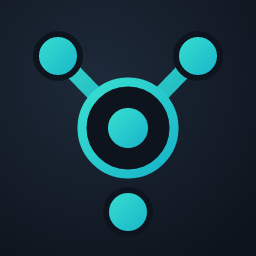

Braidcast
=========

**Stream to every platform at once.**

Braidcast is a native multi-destination live-streaming studio: build one
composited production and fan it out to Twitch, YouTube, Kick, and more,
simultaneously.

What is Braidcast?
------------------

Instead of a single output, Braidcast is organized around **canvases** — each
canvas has its own resolution, FPS, and encoder settings. You bind any number
of streaming destinations to a canvas, and Braidcast **encodes once per canvas
and multiplexes** the encoded stream out to every enabled destination bound to
it. One production, many platforms, encoded once. The desktop UI is a
CEF-hosted Svelte frontend.

Features
--------

- **Multi-destination streaming** — go live to Twitch, YouTube, Kick, and other
  RTMP/RTMPS destinations at the same time from a single Go Live.
- **Canvas-based pipeline** — independent encode targets (resolution, FPS,
  encoder) with per-canvas preview docks and scene layout.
- **Encode-once fan-out** — encode a canvas once, multiplex to every enabled
  destination bound to it.
- **Platform accounts + Go Live** — OAuth sign-in and stream metadata for
  supported platforms, with a single Go Live flow.
- **Creator engagement** — unified multichat, aggregate viewer counts, an
  events/alerts feed, and browser-source overlay widgets.

Built on OBS Studio
-------------------

Braidcast is **forked from OBS Studio** (https://obsproject.com), licensed
GPLv2+. It inherits OBS Studio's capture, compositing, encoding, and plugin
ecosystem as its upstream base. Braidcast is an independent product and is not
affiliated with or endorsed by the OBS Project.

It is distributed under the GNU General Public License v2 (or any later
version) — see the accompanying COPYING file for more details.

Build
-----

Braidcast uses CMake presets (see ``CMakePresets.json``); there is no plain
``cmake .`` flow. Fetch submodules, then configure and build for your platform,
for example on Windows::

    git submodule update --init --recursive
    cmake --preset windows-x64
    cmake --build --preset windows-x64 --config RelWithDebInfo

Upstream OBS Studio resources
-----------------------------

The following are genuine OBS Studio (upstream) resources. They cover the
underlying engine and its contribution process, not Braidcast-specific
workflows:

- OBS Studio website: https://obsproject.com

- OBS Studio Help/Documentation/Guides: https://github.com/obsproject/obs-studio/wiki

- OBS Studio Forums: https://obsproject.com/forum/

- OBS Studio Build Instructions: https://github.com/obsproject/obs-studio/wiki/Install-Instructions

- OBS Studio Developer/API Documentation: https://obsproject.com/docs

- OBS Studio Bug Tracker: https://github.com/obsproject/obs-studio/issues

- If you would like to help fund or sponsor upstream OBS Studio, you can do so
  via `Patreon <https://www.patreon.com/obsproject>`_, `OpenCollective
  <https://opencollective.com/obsproject>`_, or `PayPal
  <https://www.paypal.me/obsproject>`_. See the OBS Studio `contribute page
  <https://obsproject.com/contribute>`_ for more information.

SAST Tools
----------

`PVS-Studio <https://pvs-studio.com/pvs-studio/?utm_source=website&utm_medium=github&utm_campaign=open_source>`_ - static analyzer for C, C++, C#, and Java code.
